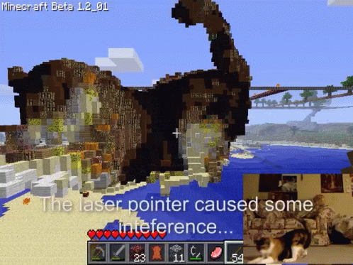

hiii meow, code hacker man here i made client!!!! it worky!!!! it gui!!!! it module!!! it larp!!

here some features i geuss

### Combat

* Aura:         just simple kill aura, has range and rotation setting
* Surround:     it works i guess, theres also russian gay surround but we dont talk about it
* Velocity:     no knockback
* AutoTotem:    i dont want to die
* Auto32k:      dont take this seriously, it works like once.

### Movement

* Boatfly:      fly the entity
* Flight:       has a creative fly mode and an antikick toggle, noevent mode doesnt work
* Speed:        bad strafe and boost mode
* Sprint:       sprinting yeah
* AntiHunger:   food is no more
* Nofall:       scuffed nofall
* FakeSneak:    doesnt allow you to walk of blocks
* NoSlow:       no slow down when eating
* GUIMove:      allows you to move in guis

### Render

* Fullbright:   this fucks your world in singleplayer. works fine
* Xray:         "baritone is for zoomers" agreed, works with sodium btw
* Nofog:        removes render distance and nether fog
* NoEffectHud:  removes the vanilla potion effect hud
* NoBossBar:    removes boss bars rendering on screen
* CleanView:    gets rid of potion particles when in first person
* ViewClip:     third person camera clips through blocks and custom range

### Exploit

* WGbypass:     bypasses worldguard entry flag, liveoverflow larp

### World

* Scaffold:     really shitty scaffold

### Misc

* HoldAction:   continuous breaking or using
* Timestamps:   shows timestamp for chat messages
* ChestSwap:    swaps chestplate with elytra and vice versa
* PortalGUI:    allows opening GUI's in portals
* AutoFish:     automatically fishes for you
* PartyChat:    simple module that turns party chat on and off for constantiam
* LOharvest:    harvest thing from liveoverflow video

it doesn't have a config btw, so all settings and binds get reset every restart. there is a module that just toggles and binds a bunch of stuff to my liking just so i can have a weird config thing.

there will be no pre builds in releases. build it yourself
